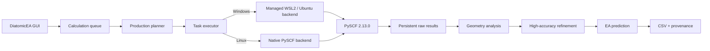

<div align="center">

# DiatomicEA

### Fast and reproducible electron-affinity calculations for diatomic molecules.

[](https://github.com/Paranoidgrinch/diatomic-ea/releases/latest)
[](https://www.python.org/)
[](https://www.riverbankcomputing.com/software/pyqt/)
[](https://pyscf.org/)
[](LICENSE)

**Desktop workflow · Windows + WSL2 · Native Linux · Reproducible outputs · Resume support**

[**Download DiatomicEA 1.0.0**](https://github.com/Paranoidgrinch/diatomic-ea/releases/latest) ·
[Installation](docs/INSTALLATION.md) ·
[User guide](docs/USER_GUIDE.md) ·
[Report an issue](https://github.com/Paranoidgrinch/diatomic-ea/issues)

</div>

---

## What is DiatomicEA?

**DiatomicEA** is an open-source desktop and command-line application for automated electron-affinity calculations of diatomic molecules.

It turns a multi-stage quantum-chemistry workflow into one reproducible calculation:

```text
Molecule
   ↓
Initial geometry scan
   ↓
Geometry analysis
   ↓
High-accuracy refinement
   ↓
EA prediction
   ↓
Results + prediction intervals + provenance
```

The application handles calculation planning, parallel single-point jobs, state scans, refinement, statistical reduction, persistent raw results, live progress reporting and final CSV export.

On **Windows**, the desktop application runs natively while the PySCF compute backend is isolated in **WSL2 / Ubuntu 24.04**. On **Linux**, both GUI and compute backend run natively.

---

## Highlights

- **Desktop GUI** built with PyQt5
- **Calculation queue** for multiple diatomic molecules
- **Automatic CPU detection** with user-selectable worker count
- Heavy calculations run in **worker processes**, never in the GUI thread
- **Live progress, throughput and ETA**
- **Persistent calculations** with reuse of completed single-point results
- **Resume / retry** support for interrupted or failed runs
- Fixed and reproducible scientific workflow
- Four-functional high-accuracy EA prediction
- **80%, 90% and 95% prediction intervals**
- Individual PBE, B3LYP, PBE0 and TPSSh EA values
- Raw and final CSV output
- Compute-backend and wheel provenance
- Release artifacts with **SHA-256 checksums**
- Windows/WSL2 and native Linux support

---

## Quick start

### Windows

Download and extract the latest release:

[**DiatomicEA-1.0.0.zip**](https://github.com/Paranoidgrinch/diatomic-ea/releases/latest)

Open PowerShell in the extracted folder and run:

```powershell
.\scripts\install_windows.ps1
```

The installer creates a private application environment, installs the GUI, prepares the managed WSL compute backend, deploys the matching DiatomicEA wheel and performs a real backend validation.

If Ubuntu 24.04 is not yet available under WSL:

```powershell
.\scripts\install_windows.ps1 -InstallWSL
```

DiatomicEA does **not** restart Windows automatically.

To also create a desktop shortcut:

```powershell
.\scripts\install_windows.ps1 -DesktopShortcut
```

After installation, launch **DiatomicEA** from the Start menu.

### Linux

From the extracted release bundle:

```bash
chmod +x scripts/install_linux.sh
./scripts/install_linux.sh
```

The Linux installer creates a private environment, installs PyQt5, PySCF 2.13.0 and basis-set-exchange, validates the compute backend and creates GUI/CLI launchers.

For detailed setup instructions, see **[docs/INSTALLATION.md](docs/INSTALLATION.md)**.

---

## Using the desktop application

### 1. Define the molecule

Enter the element symbols for the two atoms.

Examples:

```text
O  H
Al O
Mg O
```

DiatomicEA normalizes the formula and validates the elements before adding a calculation to the queue.

### 2. Choose calculation settings

The GUI exposes only molecule-specific settings that are intended to vary:

| Setting | Purpose |
|---|---|
| **Bond-length scan** | Lower and upper limits of the initial geometry scan |
| **Maximum spin (2S)** | Highest spin value considered in neutral/anion state scans |
| **Workers** | Number of parallel worker processes |

The scientific method itself remains fixed for reproducibility.

### 3. Add calculations to the queue

Select **Add to queue** to freeze the settings for a molecule.

Queued calculations can be reordered or removed before execution. DiatomicEA processes **one molecule at a time**, while parallelizing the expensive work within the active molecule.

### 4. Start the queue

Select **Start queue**.

During a calculation, the GUI reports:

- current calculation stage
- completed tasks
- percentage
- tasks per second
- estimated time remaining
- elapsed stage time

### 5. Inspect the result

A completed calculation displays:

- **predicted electron affinity**
- **80%, 90% and 95% prediction intervals**
- functional half-range
- PBE EA
- B3LYP EA
- PBE0 EA
- TPSSh EA

Use **Open results folder** to access the complete calculation record.

---

## Scientific workflow

DiatomicEA v1.0.0 uses a fixed calculation protocol designed for reproducible prediction rather than interactive method selection.

### Initial geometry scan

The fast grid combines:

**Functionals**

- PBE
- B3LYP
- PBE0
- TPSSh

**Basis sets**

- def2-SVP
- def2-TZVP
- def2-TZVPP
- def2-SVPD
- def2-TZVPD

Neutral and anionic spin states are scanned across the requested bond-length range. The workflow retains method/state minima and performs geometry analysis before refinement.

### High-accuracy refinement

The refinement stage uses **def2-QZVPD** around the selected geometries, with a focused bond-length scan and the most relevant spin states from the initial stage.

For atoms beyond krypton, the corresponding def2 effective-core-potential treatment is used.

### Electron-affinity prediction

For the four high-accuracy functional EA values \(q_f\):

\[
m_{\mathrm{QZ}} = \operatorname{median}(q_f)
\]

\[
h_{\mathrm{QZ}} = \frac{\max(q_f)-\min(q_f)}{2}
\]

The final prediction is

\[
EA_{\mathrm{pred}} = m_{\mathrm{QZ}} + 0.0825\ \mathrm{eV}
\]

with uncertainty scale

\[
s(h)=\exp(-2.4496 + 3.0511h).
\]

Prediction intervals are reported at **80%, 90% and 95%**.

A full prediction requires all four high-accuracy functional results to pass the workflow's hard-warning criteria.

---

## Reproducibility by design

DiatomicEA treats reproducibility as part of the calculation, not as an afterthought.

Each production run preserves:

```text
production run
├── immutable calculation plan
├── raw single-point results
├── progress / event records
├── geometry and refinement data
├── final CSV result
├── run manifest
└── compute-backend provenance
```

On Windows, the application records the compute environment and deploys the **exact DiatomicEA wheel** used for the run into the managed WSL worker environment.

Successful raw tasks are persisted so interrupted calculations can resume without silently recomputing completed work.

---

## Output

The final result contains the predicted EA together with the intermediate statistical quantities and individual functional values.

Typical fields include:

```text
molecule
ea_pbe_eV
ea_b3lyp_eV
ea_pbe0_eV
ea_tpssh_eV
median_qz_eV
half_range_qz_eV
predicted_ea_eV
pi80_lower_eV
pi80_upper_eV
pi90_lower_eV
pi90_upper_eV
pi95_lower_eV
pi95_upper_eV
```

Raw task records are retained alongside the final result for inspection and reproducibility.

---

## Platform architecture



The compute backend is independent of the Qt GUI. The command-line workflow remains available alongside the desktop application.

---

## Command line

After installation:

```bash
diatomic-ea --help
```

The desktop application can also be launched directly with:

```bash
diatomic-ea-gui
```

---

## Stored calculation data

On Windows, production calculations are stored below:

```text
%LOCALAPPDATA%\DiatomicEA\production_runs
```

On systems without `LOCALAPPDATA`, DiatomicEA uses:

```text
~/.diatomic-ea/production_runs
```

Calculation data are intentionally kept separate from the source repository and application installation.

---

## Release integrity

Every official release contains:

- platform-neutral release ZIP
- Python wheel
- Python source distribution
- `SHA256SUMS.txt`
- `release_manifest.json`

For v1.0.0, use the assets attached to the official GitHub release:

[**DiatomicEA 1.0.0 release**](https://github.com/Paranoidgrinch/diatomic-ea/releases/tag/v1.0.0)

---

## Development

Clone the repository and install the development environment:

```bash
python -m pip install -e ".[dev,gui]"
```

Run the test suite:

```bash
python -m pytest
```

Build release archives:

```bash
python scripts/build_release.py
```

Repository layout:

```text
diatomic-ea/
├── src/diatomic_ea/   # application and scientific workflow
├── tests/             # automated test suite
├── scripts/           # release/install/uninstall tooling
├── docs/              # installation and user documentation
├── pyproject.toml
├── README.md
└── LICENSE
```

---

## Documentation

- **[Installation guide](docs/INSTALLATION.md)**
- **[User guide](docs/USER_GUIDE.md)**
- **[Latest release](https://github.com/Paranoidgrinch/diatomic-ea/releases/latest)**
- **[Issue tracker](https://github.com/Paranoidgrinch/diatomic-ea/issues)**

---

## Citation

If you use DiatomicEA in scientific work, please cite the software version used and link to the corresponding GitHub release.

For reproducible work, record the release version together with the run manifest and compute provenance produced by DiatomicEA.

---

## License

DiatomicEA is distributed under the **GNU General Public License v3.0 only (GPL-3.0-only)**.

See **[LICENSE](LICENSE)** for the full license text.

---

<div align="center">

### DiatomicEA

**From molecule definition to reproducible electron-affinity prediction.**

[Download](https://github.com/Paranoidgrinch/diatomic-ea/releases/latest) ·
[Documentation](docs/USER_GUIDE.md) ·
[Issues](https://github.com/Paranoidgrinch/diatomic-ea/issues)

</div>
